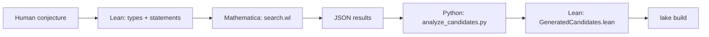

# Architecture: 4-stage AQEI-bridge pipeline

This repo implements a repeatable loop:

1. **Stage I (Lean): language / formal interface**
   - Defines toy-model types, cones, and *typed statements*.
   - Keeps a strict boundary: no heuristic claims are assumed true in Lean.

2. **Stage II (Ansatz): model reduction choices**
   - Picks a finite-dimensional stress-energy ansatz (Gaussian wavepackets).
   - Picks a causal-observable proxy $\Delta$ (ray integral) used only for search.

3. **Stage III (Mathematica): heuristic “destruction” search**
   - Solves a toy linearized equation via FFT + regularization.
   - Optimizes $\Delta$ subject to (currently) proxy AQEI halfspace constraints.
   - Writes `mathematica/results/summary.json` and `mathematica/results/top_candidates.json`.

4. **Stage IV (Python): formal synthesis**
   - Reads Mathematica JSON, rationalizes floats, and emits Lean data in
     `lean/src/AqeiBridge/GeneratedCandidates.lean`.
   - Runs `lake build` to ensure Lean typechecks.

## Dataflow diagram

## Key invariants

- **Formal vs heuristic separation**
  - Any claim that depends on PDE → observable reduction is labeled *heuristic*.
  - Lean only receives: finite vectors, inequalities, and explicitly stated axioms.

- **Small runnable examples**
  - The default test configs use `AQEI_NUM_BASIS=2`, coarse grids, and a small number
    of constraints to keep runtime low.

## Reference-only dependency

This repo is independent of the in-review manuscript, but development is expected
to track (and cite) it as the source of the real AQEI functionals and analytic
lemmas:

- Local manuscript: `~/Code/asciimath/energy-tensor-cone/papers/aqei-cone-formalization-cqg.tex`
- Related repo: https://github.com/DawsonInstitute/energy-tensor-cone

Nothing in this repo should copy long passages verbatim; it should reference
results and reconstruct only what is needed for the SciPost bridge paper.
